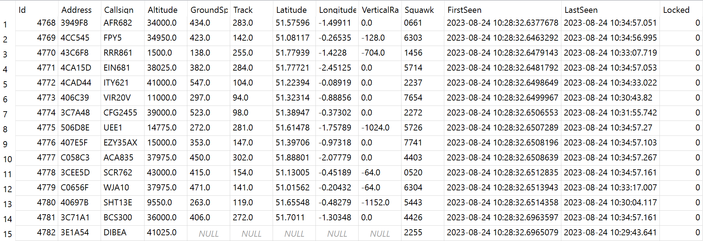

# ADS-B-BaseStationReader

[](https://github.com/davewalker5/ADS-B-BaseStationReader/actions)
[](https://github.com/davewalker5/ADS-B-BaseStationReader/issues)
[](https://coveralls.io/github/davewalker5/ADS-B-BaseStationReader?branch=master)
[](https://github.com/davewalker5/ADS-B-BaseStationReader/releases)
[](https://github.com/davewalker5/ADS-B-BaseStationReader/blob/master/LICENSE)
[](https://github.com/davewalker5/ADS-B-BaseStationReader/)
[](https://github.com/davewalker5/ADS-B-BaseStationReader/)
[](https://github.com/davewalker5/ADS-B-BaseStationReader/)

## Overview


- An RTL2832/R820T2 USB Dongle is plugged into the Raspberry Pi
- The Raspberry Pi is running the [dump1090-mutability](https://github.com/adsb-related-code/dump1090-mutability) service to decode the data from the dongle
- One of the outputs is a decoded stream of messages in "[Basestation](http://woodair.net/sbs/article/barebones42_socket_data.htm)" format, that is exposed on a TCP port on the Pi
- This stream is read by the MessageReader, that exposes an event used to notify subscribers when a new message arrives
- The AircraftTracker subscribes to these events and passes each new message to the message parsers to have the information it contains extracted into an aircraft tracking object
- The AircraftTracker enqueues each new tracking object for asynchronous writing to the SQLite database
- It also exposes events to notify subscribers when aircraft are added, updated and removed
- On a timed interval, the QueuedWriter processes pending writes from the the queue

## The Console Application
- The repository includes a console application that uses the [Spectre.Console package](https://github.com/spectreconsole/spectre.console) to render a live view of the aircraft currently being tracked:


- The application subscribes to the events exposed by the AircraftTracker (see below) to implement continuous live updates
- As an aircraft's details are updated on receipt of a new messages, it's details are immediately updated in the live view
- As it moves through the tracking states (see below), it will be highlighted in yellow, when it reaches the "Recent" state, and red, when it reaches the "Stale" state
- When it is removed from the tracker's tracking list, it is also removed from the live table

## Aircraft Tracking

### Adding and Updating Tracking Objects
- Aircraft are identified by their [ICAO 24-bit address](https://en.wikipedia.org/wiki/Aviation_transponder_interrogation_modes)
- When a new aircraft is seen for the first time in a session, it is added to the collection of tracked aircraft
- In the first instance, the tracking object is populated with data from the initial message that caused it to be added to the tracking collection
- As new messages come in for that aircraft, the existing tracking object is updated with new/updated information from each new message

### Event Model
- The AircraftTracker exposes the following events that subscribers can subscribe to to receive updates on tracked aircraft:
    - Aircraft added
    - Aircraft updated
    - Aircraft removed
- The event notification for each event includes the current tracking object for the aircraft

### Tracked Aircraft States
- Tracked aircraft pass through the following set of states from the point where they are added:
    - New
    - Recent
    - Stale
    - Removed
- The states have the following meanings:

| State | Meaning |
| --- | --- |
| New | The aircraft has just been added and ongoing messages are being received from it |
| Recent | Messages are not being received from the aircraft but they have been received recently |
| Stale | Messages have not been received from the aircraft for some time and it will shortly be removed from the tracking list |
| Removed | The aircraft has been removed from the tracking list |

- Changes in state are communicated to AircraftTracker subscribers via the "aircraft updated" event (see above), with the state as a property of the tracking object

## Message Parsing
- The AircraftTracker is supplied with a dictionary of message parsers, each associated with a [Basestation message type](http://woodair.net/sbs/article/barebones42_socket_data.htm)
- As messages are received, the tracker selects the appropriate parser based on the message type
- Currently, the only parser that has been implemented is for the MSG message type

## SQLite Database

### Database Schema
- Tracking records are written to a single table, called AIRCRAFT, summarising the detail from the messages received for a given aircraft:



### Database Management
- The application uses Entity Framework Core and initial creation and management of the database is achieved using EF Core database migrations
- To create the database for the first time, first install the .NET Core SDK and then install the "dotnet ef" tool:

```bash
dotnet tool install --global dotnet-ef
```

- Update the database path in the "appsettings.json" file in the terminal application project to point to the required database location
- Build the solution
- Open a terminal window and change to the BaseStation.Data project
- Run the following command, making sure to use the path separator appropriate for your OS:

```bash
dotnet ef database update -s ../BaseStationReader.Manager/BaseStationReader.Manager.csproj
```

- If the database doesn't exist, it will create it
- It will then bring the database up to date by applying all pending migrations

### Record Locking
- As stated above, the [ICAO 24-bit address](https://en.wikipedia.org/wiki/Aviation_transponder_interrogation_modes) is used as the unique identifier for an aircraft when writing updates to the database
- Consequently, if an aircraft goes out of range then comes back into range, the original record would be picked up again on the second pass, though that pass may represent a different flight on a different date
- Further, from [this article](https://en.wikipedia.org/wiki/Aviation_transponder_interrogation_modes):

> Mode S equipped aircraft are assigned a unique ICAO 24-bit address or (informally) Mode-S "hex code" upon national registration and this address becomes a part of the aircraft's Certificate of Registration. Normally, the address is never changed, however, the transponders are reprogrammable and, occasionally, are moved from one aircraft to another (presumably for operational or cost purposes), either by maintenance or by changing the appropriate entry in the aircraft's Flight management system

- The record for a given address should only be updated while the aircraft in question remains in range
- Once it passes out of range, or when a new tracking session is started, if the address is seen again it should result in a new tracking record
- This is achieved using the "Locked" flag on tracking records (see the screenshot, above):
    - When an aircraft moves out of range and is removed from the tracking collection, its associated record is marked as "Locked"
    - When the QueuedWriter starts, it immediately queues updates to mark all records that are not currently locked as locked, before accepting any other updates into the queue
- Records marked as "Locked" are not considered candidates for further updates

### Queued Writing
- [SQLite](https://sqlite.org/index.html) has been chosen as an appropriate DBMS for storing the data
- It allows multiple readers but, at any one time, there can only be a single writer
- As indicated above, the AircraftTracker exposes multiple events that require updates to be written to the database
- If the console application attempts to write to the database from the event handlers as soon as an event notification is received, at some point a conflict arises between multiple concurrent updates and a "database is locked" error is thrown
- Asynchronous, queued writing to the tracking database is required to avoid these conflicts and this is what the FIFO queue and the QueuedWriter implement
- This architecture has the further advantage that database updates are separated from the subscribing application

## Authors

- **Dave Walker** - *Initial work* - [LinkedIn](https://www.linkedin.com/in/davewalker5/)

## Feedback

To file issues or suggestions, please use the [Issues](https://github.com/davewalker5/ADS-B-BaseStationReader/issues) page for this project on GitHub.

## License

This project is licensed under the MIT License - see the [LICENSE](LICENSE) file for details.
