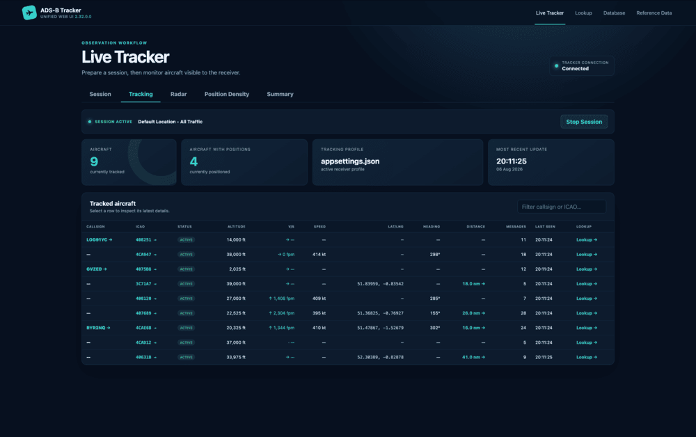

# ADS-B BaseStation Reader

## About

**ADS-B BaseStation Reader** is a local-first aircraft observation workspace that turns ADS-B signals received directly by the user into useful, inspectable records of what was observed.

The application consumes decoded messages in BaseStation format, typically supplied by `dump1090` connected to an RTL-SDR receiver. It organises each tracking run as an observation session, maintains a live view of aircraft currently being received, stores observations and position histories locally in SQLite, and provides an integrated browser-based UI supporting live observation, investigation, contextual aviation information, reference-data management and post-session analysis.

Core tracking does not depend on a commercial flight-tracking service. External APIs are optional and are used only for transient ancillary lookup, schedule, weather and enrichment workflows.

## Features

The project currently supports:

- **Session-based aircraft observation** from a BaseStation-compatible TCP message feed
- **Observation-session preparation** with receiver host and port, tracking-profile selection and optional contextual notes
- **Live aircraft tracking and receiver-centred radar** within the active observation session
- **Read-only session summaries** covering tracking activity, identification coverage and session highlights
- **Configurable tracking profiles** based on receiver location, altitude, distance and aircraft behaviour
- **Local SQLite persistence** of observation sessions, aircraft records and optional position histories
- **Integrated browser-based UI** organised around live observation, contextual aviation information and reference-data management
- **Historical observation browsing** with dedicated session, session-editor and tracking-record views, filtering and record inspection
- **Historical session management** with notes-only editing and confirmed deletion while no observation session is active
- **Post-session analysis** available directly from the session browser
- **Interactive live radar plus 2D and 3D flight-path visualisation**
- **Tabbed contextual lookup workspace** for aircraft and flights, airport schedules, route visualisation and METAR/TAF weather
- **Reference-data management and CSV import** for:
  - Airlines
  - Manufacturers
  - Aircraft models
  - Aircraft
  - Airports
  - Flight-number and callsign mappings
- **First-class data provenance** for imported reference datasets
- **Aircraft and callsign exclusion management**
- **SignalR live updates** for the integrated UI and compatible external clients
- **Console-based tracking** for lightweight and headless environments
- **ADS-B simulation** for development and testing without live radio traffic
- **Docker support** for containerised deployment

## Local-First Observation

ADS-B BaseStation Reader deliberately distinguishes between three kinds of information:

### Observation

Data received directly from the ADS-B message stream, such as:

- ICAO 24-bit aircraft address
- Callsign
- Position
- Altitude
- Speed
- Heading
- Vertical rate

### Interpretation

Information derived locally from those observations, including:

- Distance from the receiver
- Climbing, descending or level flight
- Tracking-profile inclusion
- Aircraft lifecycle state
- Flight-path history

### Context

Operational information used to support an observing session, including airport schedules, route visualisation and weather.

Context helps explain what is being observed but is intentionally treated as transient information. Unlike locally curated reference data, it is not considered part of the observation record and is not used to populate the application's reference database.

### Enrichment

Additional reference information used to make an observation more recognisable, such as:

- Aircraft registration
- Manufacturer and model
- Airline
- Flight number
- Origin and destination
- Airport information

Locally managed reference data is preferred wherever possible. External API responses are treated as transient and are not used to populate or update the local reference database.

## Data Provenance

Imported reference data is associated with a provenance record identifying its source, dataset, version and licence.

This allows locally stored reference information to remain traceable to the dataset from which it originated and helps preserve the distinction between:

- Directly observed ADS-B data
- Derived information
- Locally curated reference data
- Externally sourced enrichment

> [!IMPORTANT]
> Only import or retain data that you are permitted to store and reuse.
>
> The availability of an import, lookup or storage feature does not imply that data from a particular source may legally be persisted, transformed, redistributed or reused. Check the applicable licence and terms of service before importing or retaining third-party data.

## Integrated UI

The Tracker Hub hosts the main browser-based interface and brings the project's operational workflows together in one application.

The interface is organised around the natural workflow of an aircraft observer:

### Observation Workflow

The Live Tracker brings the active observation workflow together in four tabs:

> Session &rarr; Tracking &harr; Radar &rarr; Summary

- **Session** — set the receiver host and port, select a tracking profile, review the effective receiver and tracking limits, add optional notes, and start the session
- **Tracking** — monitor the live aircraft collection, inspect current telemetry, and move directly to Lookup or historical records
- **Radar** — view positioned aircraft by range and bearing from the receiver; this tab is available only while a session is active
- **Summary** — review the persisted session context, tracking activity, identification coverage, and notable observations

Each session records the receiver host and port, a snapshot of the effective tracking profile, and the aircraft records created during that run. Receiver details initially default to the values configured in `appsettings` and then retain the last-used values until Tracker Hub is restarted. Session parameters become fixed when tracking starts; after the session has stopped, its notes can be updated through the Database Session Editor. When tracking stops, outstanding observations are persisted before the completed summary is displayed.

### Observation and Investigation

The primary observation tools used while tracking aircraft:

- Session-based Live Tracking
- Integrated receiver-centred Radar
- Aircraft and Flight Lookup
- Historical Database Browser with Sessions, Tracking Records and Session Editor tabs
- Historical aircraft details and flight analysis

These views focus on aircraft currently being observed or previously recorded, allowing observations to be inspected, identified and analysed.

The Database opens on the **Sessions** tab. Sessions can be filtered using the recent-session selector or an unrestricted start-date range. Each row exposes its recorded context, including receiver host and port, provides session notes in a popup, opens the same analysis shown by the Live Tracker Summary tab, and links directly to the associated tracking records—even when the session is older than the recent-session dropdown.

When no observation session is active, session results provide **Edit** and **Delete** actions. Edit opens **Session Editor**, where notes can be updated and the session can also be deleted. Deletion requires confirmation and removes the session together with its tracked-aircraft records and position histories. The editor and both actions are unavailable during an active session. The **Tracking Records** tab retains aircraft, callsign, session and telemetry filtering, along with links to detailed historical records.

### Operational Context

The **Lookup** area groups supporting aviation information into a single tabbed workspace:

- Aircraft and Flights
- Schedule
- Route
- Weather

Links between these tools preserve their context—for example, a schedule result can be opened as a route or weather lookup. These workflows help explain what is being observed while remaining conceptually separate from the tracking data itself.

### Reference Data Management

The **Reference Data** area provides tools for maintaining the locally curated information used by the application:

- Import
- Provenance
- Data Management:
  - Aircraft
  - Airlines
  - Airports
  - Flights
  - Manufacturers
  - Models

The data management tabs allow search, editing, deletion and addition of reference data records. Each record remains linked to a provenance record describing its source. Reference data records remain searchable during live tracking, but cannot be added, changed or deleted until the session ends.

The **Aircraft**, **Airlines**, **Airports** and **Flights** tabs allow search, editing, deletion and addition of reference data records. Each record remains linked to a provenance record describing its source. Reference data records remain searchable during live tracking, but cannot be added, changed or deleted until the session ends.

This organisation reinforces the distinction between observed ADS-B data, transient contextual information and locally managed enrichment data.

The same underlying tracking core can also be used through the console tracker or exposed headlessly through SignalR.

## Deployment

ADS-B Tracker supports several deployment styles:

### Integrated UI

The Tracker Hub hosts both the SignalR service and browser-based UI and is suitable for normal desktop or server-based operation.

### Docker

The integrated UI is available as a containerised application and can connect to a BaseStation feed running:

- On the Docker host
- In another container
- On another machine on the network

### Console

The console tracker provides a lightweight live display suitable for:

- Raspberry Pi deployments
- Small displays
- Terminal-based monitoring
- Headless or low-resource environments

## Getting Started

Full configuration details, deployment guidance and user documentation are available in the [project Wiki](https://github.com/davewalker5/ADS-B-BaseStationReader/wiki).

For Docker deployment, see the documentation for the `davewalker5/adsbtracker` image on [Docker Hub](https://hub.docker.com/repository/docker/davewalker5/adsbtracker).

## Authors

- **Dave Walker** - *Initial work* -

## Feedback

To file issues or suggestions, please use the [Issues](https://github.com/davewalker5/ADS-B-BaseStationReader/issues) page for this project on GitHub.

## License

This project is licensed under the MIT License - see the [LICENSE](LICENSE) file for details.
