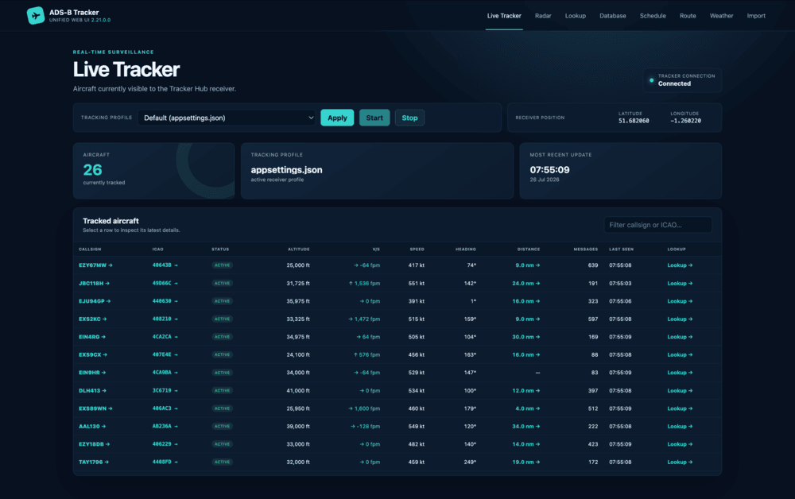

# ADS-B BaseStation Reader

## About

**ADS-B BaseStation Reader** is a local-first personal aircraft observation and analysis system that turns ADS-B signals received directly by the user into useful, inspectable records of what was observed.

The application consumes decoded messages in BaseStation format, typically supplied by `dump1090` connected to an RTL-SDR receiver. It maintains a live view of aircraft currently being received, stores observations and position histories locally in SQLite, and provides an integrated browser-based UI for monitoring, investigation, reference-data management and post-session analysis.

Core tracking does not depend on a commercial flight-tracking service. External APIs are optional and are used only for transient ancillary lookup, schedule, weather and enrichment workflows.

## Features

The project currently supports:

- **Live aircraft tracking** from a BaseStation-compatible TCP message feed
- **Configurable tracking profiles** based on receiver location, altitude, distance and aircraft behaviour
- **Local SQLite persistence** of aircraft observations and optional position histories
- **Integrated browser-based UI** hosted by the Tracker Hub
- **Historical observation browsing** with filtering and record inspection
- **2D and interactive 3D flight-path visualisation**
- **Aircraft and flight lookup** using local reference data and optional external services
- **Airport schedules** for supported external providers
- **METAR and TAF weather lookup**
- **Reference-data management and CSV import** for:
  - Airlines
  - Manufacturers
  - Aircraft models
  - Aircraft
  - Airports
  - Flight-number and callsign mappings
- **First-class data provenance** for imported reference datasets
- **Aircraft and callsign exclusion management**
- **SignalR live updates** for the integrated UI and compatible external clients
- **Console-based tracking** for lightweight and headless environments
- **ADS-B simulation** for development and testing without live radio traffic
- **Docker support** for containerised deployment

## Local-First Observation

ADS-B BaseStation Reader deliberately distinguishes between three kinds of information:

### Observation

Data received directly from the ADS-B message stream, such as:

- ICAO 24-bit aircraft address
- Callsign
- Position
- Altitude
- Speed
- Heading
- Vertical rate

### Interpretation

Information derived locally from those observations, including:

- Distance from the receiver
- Climbing, descending or level flight
- Tracking-profile inclusion
- Aircraft lifecycle state
- Flight-path history

### Enrichment

Additional information used to make an observation more recognisable, such as:

- Aircraft registration
- Manufacturer and model
- Airline
- Flight number
- Origin and destination
- Airport information

Locally managed reference data is preferred wherever possible. External API responses are treated as transient and are not used to populate or update the local reference database.

## Data Provenance

Imported reference data is associated with a provenance record identifying its source, dataset, version and licence.

This allows locally stored reference information to remain traceable to the dataset from which it originated and helps preserve the distinction between:

- Directly observed ADS-B data
- Derived information
- Locally curated reference data
- Externally sourced enrichment

> [!IMPORTANT]
> Only import or retain data that you are permitted to store and reuse.
>
> The availability of an import, lookup or storage feature does not imply that data from a particular source may legally be persisted, transformed, redistributed or reused. Check the applicable licence and terms of service before importing or retaining third-party data.

## Integrated UI

The Tracker Hub hosts the main browser-based interface and brings the project's operational workflows together in one application.

The UI includes:

- Live Tracking
- Tracking Profile selection
- Database Browser
- Aircraft Details
- Flight-path plotting and interactive rendering
- Aircraft and Flight Lookup
- Airport Schedules
- Airport Weather
- Reference Data Import
- Provenance Management
- Exclusion Management

The same underlying tracking core can also be used through the console tracker or exposed headlessly through SignalR.

## Deployment

ADS-B Tracker supports several deployment styles:

### Integrated UI

The Tracker Hub hosts both the SignalR service and browser-based UI and is suitable for normal desktop or server-based operation.

### Docker

The integrated UI is available as a containerised application and can connect to a BaseStation feed running:

- On the Docker host
- In another container
- On another machine on the network

### Console

The console tracker provides a lightweight live display suitable for:

- Raspberry Pi deployments
- Small displays
- Terminal-based monitoring
- Headless or low-resource environments

## Getting Started

Full configuration details, deployment guidance and user documentation are available in the [project Wiki](https://github.com/davewalker5/ADS-B-BaseStationReader/wiki).

For Docker deployment, see the documentation for the `davewalker5/adsbtracker` image on [Docker Hub](https://hub.docker.com/repository/docker/davewalker5/adsbtracker).

## Authors

- **Dave Walker** - *Initial work* -

## Feedback

To file issues or suggestions, please use the [Issues](https://github.com/davewalker5/ADS-B-BaseStationReader/issues) page for this project on GitHub.

## License

This project is licensed under the MIT License - see the [LICENSE](LICENSE) file for details.
