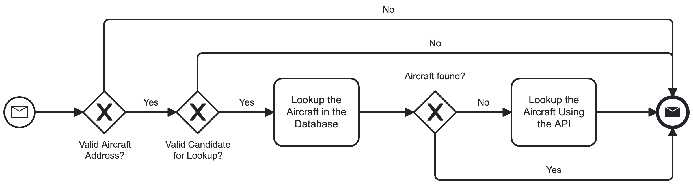

# ADS-B-BaseStationReader

[](https://github.com/davewalker5/ADS-B-BaseStationReader/actions)
[](https://github.com/davewalker5/ADS-B-BaseStationReader/issues)
[](https://coveralls.io/github/davewalker5/ADS-B-BaseStationReader?branch=main)
[](https://github.com/davewalker5/ADS-B-BaseStationReader/releases)
[](https://github.com/davewalker5/ADS-B-BaseStationReader/blob/master/LICENSE)
[](https://github.com/davewalker5/ADS-B-BaseStationReader/)
[](https://github.com/davewalker5/ADS-B-BaseStationReader/)
[](https://github.com/davewalker5/ADS-B-BaseStationReader/)

## Overview


- An RTL2832/R820T2 USB Dongle is plugged into the Raspberry Pi
- The Raspberry Pi is running the [dump1090-mutability](https://github.com/adsb-related-code/dump1090-mutability) service to decode the data from the dongle
- One of the outputs is a decoded stream of messages in "[Basestation](http://woodair.net/sbs/article/barebones42_socket_data.htm)" format, that is exposed on a TCP port on the Pi
- This stream is read by the MessageReader, that exposes an event used to notify subscribers when a new message arrives
- The AircraftTracker subscribes to these events and passes each new message to the message parsers to have the information it contains extracted into an aircraft tracking object
- The AircraftTracker enqueues each new tracking object for asynchronous writing to the SQLite database
- It also exposes events to notify subscribers when aircraft are added, updated and removed
- On a timed interval, the QueuedWriter processes pending writes from the the queue

## The Console Application

- The repository includes a console application that uses the [Spectre.Console package](https://github.com/spectreconsole/spectre.console) to render a live view of the aircraft currently being tracked:


- The application subscribes to the events exposed by the AircraftTracker (see below) to implement continuous live updates
- As an aircraft's details are updated on receipt of a new messages, it's details are immediately updated in the live view
- As it moves through the tracking states (see below), it will be highlighted in yellow, when it reaches the "Recent" state, and red, when it reaches the "Stale" state
- When it is removed from the tracker's tracking list, it is also removed from the live table

## GUI

- The repository includes a UI built using [Avalonia UI](https://www.avaloniaui.net/):


### Tracking Menu

- The tracking menu is only available when the "Live View" or "Map View" tabs are selected
- To start live tracking, select the "Start live tracking" option on this menu
- To stop live tracking, select the "Stop live tracking" option on this menu

#### Tracking Filters

- To filter the live tracking view, make sure the application is currently tracking
- Open the "Tracking Filters" dialog (Tracking > Filters)


- Enter the required filtering criteria and click "OK"
- To clear the live tracking filters, make sure the application is currently tracking
- Select "Clear filters"on the Tracking Menu

#### Aircraft Details Lookup

- To look-up aircraft details from the Live View or Database Search, click on the row containing the aircraft of interest
- The aircraft lookup dialog will be displayed, pre-populated with the aircraft address, and the lookup will be completed automatically:



- Alternatively, select the "Aircraft Lookup" option from the Tracking menu
- The same dialog is opened, but with no details pre-populated
- Enter the aircraft's ICAO address and click on the "Lookup" button to perform the lookup

#### Tracking Options

- To view/edit the tracking options, make sure the application is not currently tracking
- Open the "Tracking Options" dialog (Tracking > Options)
- The resulting dialog allows you to specify many of the tracking parameters described under "Configuration File", above


### Database Menu

- The database menu is only available when the "Database Search" tab is selected
- To search the database, select the "Search" option from the "Database" menu


- Enter the search criteria then click OK
- The database grid will be populated with any records matching the specified criteria
- To export the records currently shown in the database search results, select "Export" from the "Database" menu
- A file selection dialog will be displayed allowing you to export the results in either XLSX or CSV format

## Application Configuration File

- The console and GUI applications use a common configuration file format, described in this section

### General Settings and Database Connection String

- The appsettings.json file in the console application project contains the following keys for controlling the application:

| Section             | Key                 | Command Line        | Short Name | Purpose                                                                                                           |
| ------------------- | ------------------- | ------------------- | ---------- | ----------------------------------------------------------------------------------------------------------------- |
| ApplicationSettings | Host                | --host              | -h         | Host the reader connects to for reading messages                                                                  |
| ApplicationSettings | Port                | --port              | -p         | Port the reader connects to for reading messages                                                                  |
| ApplicationSettings | SocketReadTimeout   | --read-timout       | -t         | Timeout, in ms, for read operations on the message stream                                                         |
| ApplicationSettings | ApplicationTimeout  | --app-timeout       | -a         | Timeout (ms) after which the terminal application will quit if no messages are recieved                           |
| ApplicationSettings | TimeToRecent        | --recent            | -r         | Threshold, in ms, after the most recent message at which an aircraft is considered "recent" (see states, below)   |
| ApplicationSettings | TimeToStale         | --stale             | -s         | Threshold, in ms, after the most recent message at which an aircraft is considered "stale" (see states, below)    |
| ApplicationSettings | TimeToRemoval       | --remove            | -x         | Threshold, in ms, after the most recent message at which an aircraft is removed from tracking (see states, below) |
| ApplicationSettings | TimeToLock          | --lock              | -k         | Threshold, in ms, after which an active aircraft record is locked, having received no updates                     |
| ApplicationSettings | LogFile             | --log-file          | -l         | Path and name of the log file. If this is blank, no log file is created                                           |
| ApplicationSettings | MinimumLogLevel     | --log-level         | -ll        | Minimum message severity to log (Debug, Info, Warning or Error)                                                   |
| ApplicationSettings | EnableSqlWriter     | --enable-sql-writer | -w         | Set to true to enable the SQL writer or false to disable it                                                       |
| ApplicationSettings | WriterInterval      | --writer-interval   | -i         | Interval, in ms, at which the writer writes batches of changes from the queue to the database                     |
| ApplicationSettings | WriterBatchSize     | --writer-batch-size | -b         | Maximum number of changes to consider on each WriterInterval                                                      |
| ApplicationSettings | RefreshInterval     | --ui-interval       | -b         | GUI live view refresh interval (ms)                                                                               |
| ApplicationSettings | MaximumRows         | --max-rows          | -m         | Maximum rows in the live table view at any one time or 0 for unlimited rows                                       |
| ApplicationSettings | ReceiverLatitude    | --latitude          | -la        | Receiver latitude, used in aircraft distance calculations                                                         |
| ApplicationSettings | ReceiverLongitude   | --longitude         | -lo        | Receiver longitude, used in aircraft distance calculations                                                        |
| ApplicationSettings | Columns             | -                   | -          | Set of column definitions for columns to be included in the output                                                |
| ApplicationSettings | ApiEndpoints        | -                   | -          | Set of endpoint definitions for external APIs (GUI only)                                                          |
| ApplicationSettings | ApiServiceKeys      | -                   | -          | Set of API key definitions for external APIs (GUI only)                                                           |
| ConnectionStrings   | BaseStationReaderDB | -                   | -          | SQLite connection string for the database                                                                         |

- Values may also be passed using the indicated command line arguments, in which case the values are first read from the configuration file and then any values specified on the command line are then applied

### Column Definitions

- The Columns property in the ApplicationSettings section of the file contains a list of column definitions:

```json
[
  {
    "Property": "Address",
    "Label": "ID",
    "Format": "",
    "Context": ""
  },
  {
    "Property": "Callsign",
    "Label": "Callsign",
    "Format": "",
    "Context": ""
  },
  {
    "Property": "Latitude",
    "Label": "Latitude",
    "Format": "N5",
    "Context": ""
  }
]
```

- Each column definition contains the following items:

| Item     | Comments                                                                                 |
| -------- | ---------------------------------------------------------------------------------------- |
| Property | Case-sensitive name of the property on the Aircraft entity to be rendered in this column |
| Label    | Column title                                                                             |
| Format   | The C# format string used to render the property or blank for default formatting         |
| Context  | Specifies the named context in which the column definition is used (GUI only)            |

- The application will show only the columns listed in this section of the configuration file, showing them in the order in which they appear here and formatted according to the format specifier
- For the Console application, the format string is passed to the ".ToString()" method to format the column
- For the GUI, the format specifier given in the column definitions is a "String.Format" string adhering to the guidelines in the following article:

[String.Format Method](https://learn.microsoft.com/en-us/dotnet/api/system.string.format?view=net-7.0)

- For the console application, the "Context" property is ignored
- For the GUI, it should be one of the following values:

| Value               | Applies To                                |
| ------------------- | ----------------------------------------- |
| Blank               | Live view and the database search results |
| TrackedAircraftGrid | Live view only                            |
| DatabaseGrid        | Database search results only              |

### Row Limits and Column Control

- The maximum row limit and custom column control are intended to support running the application on small screens
- The following shows the console application running on a Raspberry Pi with 3.5" LCD screen:


### External API Configuration

- The UI application includes integration with the AirLabs public APIs for aircraft details lookup:

[AirLabs API Documentation](https://airlabs.co/docs/)

- Various levels of subscription are provided, starting with a free offering with restricted monthly lookups
- The integration is configured via the following keys in the configuration file:

| Section             | Sub-Section    | Purpose                                                                                     |
| ------------------- | -------------- | ------------------------------------------------------------------------------------------- |
| ApplicationSettings | ApiEndpoints   | A list of endpoint definitions, each containing the endpoint type, service and endpoint URL |
| ApplicationSettings | ApiServiceKeys | A list of entries mapping each service to the API key needed to access that service         |

#### ApiEndpoint Definitions

- An example API endpoint definition is shown below:

```json
{
  "EndpointType": "Airlines",
  "Service": "AirLabs",
  "Url": "https://airlabs.co/api/v9/airlines"
}
```

- Possible values for the endpoint type are:

| Type     | Description                                                               |
| -------- | ------------------------------------------------------------------------- |
| Airlines | Endpoint used to retrieve airline details given an airline IATA/ICAO code |
| Aircraft | Endpoint used to retrieve aircraft details given a 24-bit ICAO address    |

- Currently, only the AirLabs APIs are supported

#### ApiServiceKey Definitions

- An example key definition for a service is shown below:

```json
{
  "Service": "AirLabs",
  "Key": "put-your-api-key-here"
}
```

## Aircraft Tracking

### Adding and Updating Tracking Objects

- Aircraft are identified by their [ICAO 24-bit address](https://en.wikipedia.org/wiki/Aviation_transponder_interrogation_modes)
- When a new aircraft is seen for the first time in a session, it is added to the collection of tracked aircraft
- In the first instance, the tracking object is populated with data from the initial message that caused it to be added to the tracking collection
- As new messages come in for that aircraft, the existing tracking object is updated with new/updated information from each new message

### Event Model

- The AircraftTracker exposes the following events that subscribers can subscribe to to receive updates on tracked aircraft:
  - Aircraft added
  - Aircraft updated
  - Aircraft removed
- The event notification for each event includes the current tracking object for the aircraft

### Tracked Aircraft Statuses

- Tracked aircraft pass through the following set of statuses from the point where they are added:

| Status   | Value | Meaning                                                                   |
| -------- | ----- | ------------------------------------------------------------------------- |
| Active   | 0     | The aircraft has just been added and ongoing messages are being received  |
| Inactive | 1     | Messages have been received recently but are not currently being received |
| Stale    | 2     | Messages have not been received for a while - scheduled for removal       |
| Locked   | 3     | Aircraft's database record has been locked against further updates        |

- Changes in status are communicated to AircraftTracker subscribers via the "aircraft updated" event (see above), with the status as a property of the tracking object

## Message Parsing

- The AircraftTracker is supplied with a dictionary of message parsers, each associated with a [Basestation message type](http://woodair.net/sbs/article/barebones42_socket_data.htm)
- As messages are received, the tracker selects the appropriate parser based on the message type
- Currently, the only parser that has been implemented is for the MSG message type

## External Service Integration

- The section describing the configuration file, above, describes the configuration needed to enable external API integration
- When configured, the APIs are used to look up the following details based on the ICAO 24-bit address:
  - Airline
  - Model IATA and ICAO codes
- The model IATA and ICAO codes are used to look up model and manufacturer details from the local SQLite database
- Airline details and a record mapping the aircraft's ICAO address to the airline, manufacturer and model are stored in the local SQLite database, to improve lookup performance for that address

## SQLite Database

### Database Schema

- Each aircraft tracked in a given session has a record in the AIRCRAFT table that is created when the aircraft is first seen and updated as further messages are received from that aircraft:


- The altitude, latitude and longitude of an aircraft are recorded in the AIRCRAFT_POSITION table as changes are reported
- The AIRCRAFT_POSITION table has a foreign key back to the related record in the AIRCRAFT table:


### Database Management

- The application uses Entity Framework Core and initial creation and management of the database is achieved using EF Core database migrations
- To create the database for the first time, first install the .NET Core SDK and then install the "dotnet ef" tool:

```bash
dotnet tool install --global dotnet-ef
```

- Update the database path in the "appsettings.json" file in the terminal application project to point to the required database location
- Build the solution
- Open a terminal window and change to the BaseStation.Data project
- Run the following command, making sure to use the path separator appropriate for your OS:

```bash
dotnet ef database update -s ../BaseStationReader.Terminal/BaseStationReader.Terminal.csproj
```

- If the database doesn't exist, it will create it
- It will then bring the database up to date by applying all pending migrations

### Record Locking

- As stated above, the [ICAO 24-bit address](https://en.wikipedia.org/wiki/Aviation_transponder_interrogation_modes) is used as the unique identifier for an aircraft when writing updates to the database
- Consequently, if an aircraft goes out of range then comes back into range, the original record would be picked up again on the second pass, though that pass may represent a different flight on a different date
- Further, from [this article](https://en.wikipedia.org/wiki/Aviation_transponder_interrogation_modes):

> Mode S equipped aircraft are assigned a unique ICAO 24-bit address or (informally) Mode-S "hex code" upon national registration and this address becomes a part of the aircraft's Certificate of Registration. Normally, the address is never changed, however, the transponders are reprogrammable and, occasionally, are moved from one aircraft to another (presumably for operational or cost purposes), either by maintenance or by changing the appropriate entry in the aircraft's Flight management system

- The record for a given address should only be updated while the aircraft in question remains in range
- Once it passes out of range, or when a new tracking session is started, if the address is seen again it should result in a new tracking record
- This is achieved using the "Locked" status on tracking records (see the screenshot, above):
  - When an aircraft moves out of range and is removed from the tracking collection, a notional "lock timer" starts
  - If it's seen again within the timout, the record remains unlocked to avoid duplication of aircraft records for the same flight
  - Once the timeout is reached, the record is locked and any further updates for that ICAO address result in a new record
  - When the QueuedWriter starts, it immediately queues updates to mark all records that are not currently locked as locked, before accepting any other updates into the queue
- Records marked as "Locked" are not considered candidates for further updates

### Queued Writing

- [SQLite](https://sqlite.org/index.html) has been chosen as an appropriate DBMS for storing the data
- It allows multiple readers but, at any one time, there can only be a single writer
- As indicated above, the AircraftTracker exposes multiple events that require updates to be written to the database
- If the console application attempts to write to the database from the event handlers as soon as an event notification is received, at some point a conflict arises between multiple concurrent updates and a "database is locked" error is thrown
- Asynchronous, queued writing to the tracking database is required to avoid these conflicts and this is what the FIFO queue and the QueuedWriter implement
- This architecture has the further advantage that database updates are separated from the subscribing application

### Querying the Database

- To avoid conflicts between readers and writers that may cause a "database is locked" error and halt the application, [WAL journal mode](https://www.sqlite.org/wal.html) should be used when querying the database if the application is running
- The following is an example query that uses a PRAGMA to enable WAL mode then lists all aircraft in the database matching the specified [ICAO 24-bit address](https://en.wikipedia.org/wiki/Aviation_transponder_interrogation_modes):

```sql
PRAGMA journal_mode=WAL;

SELECT *
FROM AIRCRAFT
WHERE Address = '3949F8';
```

## Simulator

- The project includes a simulator that broadcasts messages in BaseStation format on the local machine
- A set of simulated aircraft, with random ICAO addresses and callsigns, are created
- At specified intervals, an MSG message with a random transmission type and a randomly selected aircraft is generated and sent to all connected clients
- Simulated aircraft have a configurable lifespan after which no further messages are sent from them, to simulate real behaviour and exercise the tracking lifecycle (see above)
- The simulator is intended for development use when no ADS-B receiver is available to provide a real message stream
- The simulator is controlled via an "appsettings.json" configuration file, supporting the following keys:

| Section             | Key              | Command Line    | Short Name | Purpose                                                                 |
| ------------------- | ---------------- | --------------- | ---------- | ----------------------------------------------------------------------- |
| ApplicationSettings | Port             | --port          | -p         | Port the simlator broadcasts on                                         |
| ApplicationSettings | SendInterval     | --send-interval | -s         | Interval at which messages are sent (ms)                                |
| ApplicationSettings | NumberOfAircraft | --number        | -n         | Number of active simulated aircraft                                     |
| ApplicationSettings | AircraftLifespan | --lifespan      | -ls        | Aircraft lifespan (ms)                                                  |
| ApplicationSettings | LogFile          | --log-file      | -l         | Path and name of the log file. If this is blank, no log file is created |
| ApplicationSettings | MinimumLogLevel  | --log-level     | -ll        | Minimum message severity to log (Debug, Info, Warning or Error)         |

## Authors

- **Dave Walker** - _Initial work_ - [LinkedIn](https://www.linkedin.com/in/davewalker5/)

## Feedback

To file issues or suggestions, please use the [Issues](https://github.com/davewalker5/ADS-B-BaseStationReader/issues) page for this project on GitHub.

## License

This project is licensed under the MIT License - see the [LICENSE](LICENSE) file for details.
